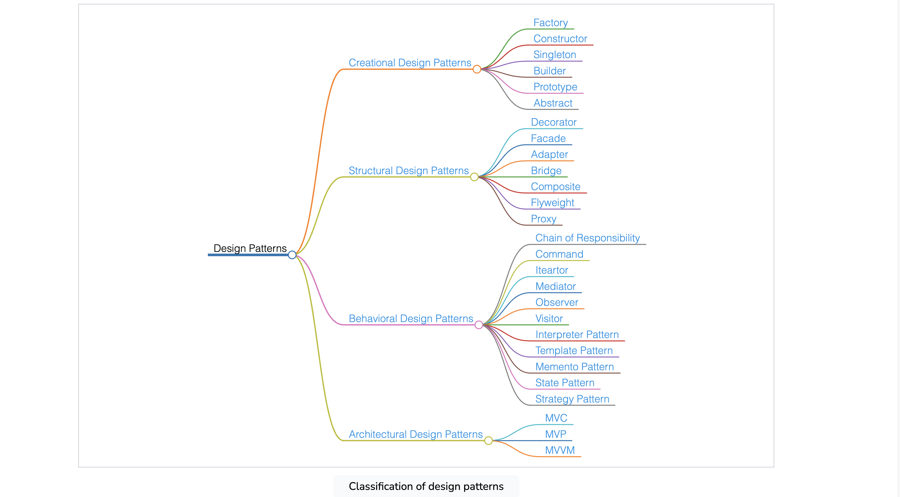

## Creational design patterns
These patterns are used to provide a mechanism for creating objects in a specific situation without revealing the creation method. These patterns allow flexibility in deciding which objects need to be created for a specific use case by providing control over the creation process.

## Structural design patterns
These patterns are concerned with class/object composition and relationships between objects. They let us add new functionalities to objects so that restructuring some parts of the system does not affect the rest. Hence, when some parts of the structure change, the entire system does not need to change.

## Behavioral design patterns
These patterns are concerned with communication between dissimilar objects in a system. They streamline communication and ensure that the information is synchronized between such objects.

## Architectural design patterns
These patterns are used for solving architectural problems within a given context in software architecture.