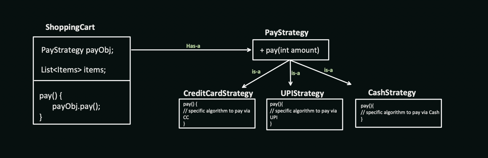

# Behavioral Design Pattern

## 1. Strategy Pattern


```Java
class ShoppingCart{
    private PayStrategy payStrategy;
    ......
    ......
    ......

    // Constructor Injection
    ShoppingCart(PayStrategy payStrategy, .....){
        this.payStrategy = payStrategy;
        .....
        .....
    }

    void pay(int amount){
         this.payStrategy.pay(amount);
    }
}

/* main */
PayStrategy creditCardStrategy = new CreditCardStrategy;
PayStrategy upiStrategy = new UPIStrategy;
shoppingCart1 = ShoppingCart(creditCardStrategy, ......);
shoppingCart1.pay(100);

shoppingCart2 = ShoppingCart(upiStrategy, ......);
shoppingCart2.pay(100);
```

- Can be useful when more than one child tends to have a common code/functionality which is not present in parent
- Helps to define multiple algorithm for the task and we can select any algorithm based on situation.

## Observer Pattern
